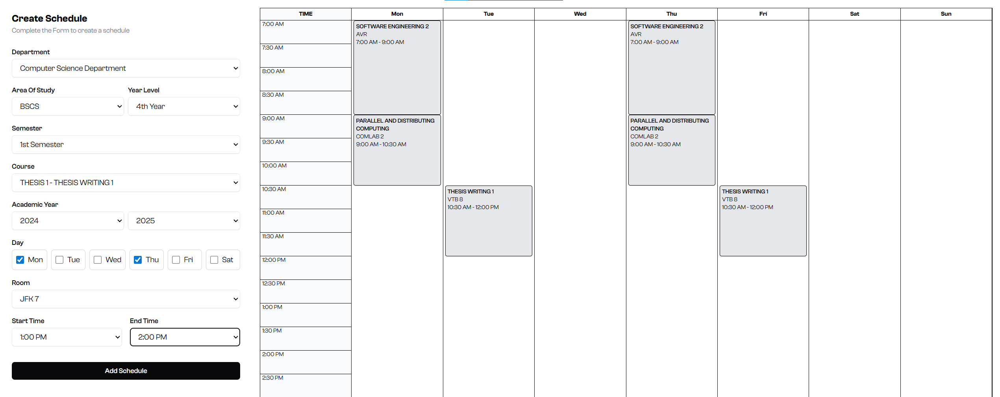

# Sched-Sync  

Sched-Sync is a scheduling system designed for schools to simplify subject and class management. It enables deans to assign subjects to student sets (sections) in specific rooms on chosen days and times, while ensuring there are no schedule conflicts. The system focuses on efficiency, clarity, and ease of use for academic scheduling.  

## Key Features  

- Create and manage subjects  
- Assign subjects to sets (sections)  
- Room and time slot management  
- Automatic conflict detection (no overlapping schedules)  
- Clean and intuitive interface  

## Tech Stack  

- **Frontend:** React, Tailwind CSS  
- **Backend:** Node.js, Express  
- **Database:** MongoDB  

## UI Overview  

  
    

  

